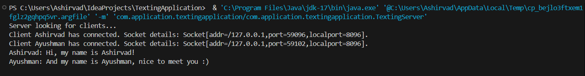

# TextingApplication
This is a project to allow users to run their own group chat servers and allow others along with themselves to connect to each others' servers to communicate.

## Outputs
### Server

### Client 1

### Client 2

## Concepts used in this project
~ Networking & Socket programming

~ Multithreading

~ Collections Framework

~ Streams

## Improvements to be made
~ "Command-Line"-based operations -----> Full fledged JavaFX application

~ Encryption-Decryption for user privacy

~ Seemless user interface to allow users to easily build and connect to other servers

~ Improve performance and efficiency
